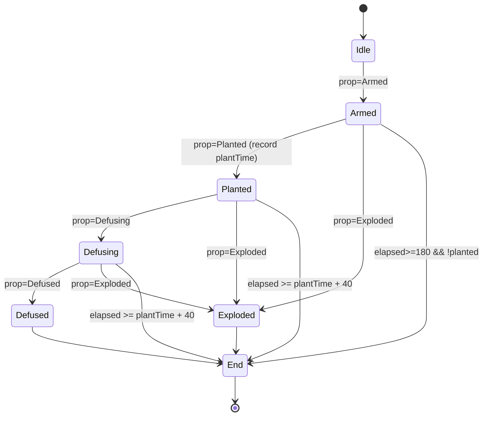

# AGENTS.md

**Project**: Laser Tag Defusal Mode Orchestrator (Windows)

This Windows-based C# (.NET 9) application coordinates a laser tag “defusal” mode by monitoring bomb prop and game clock data over HTTP, determining match end conditions, and signaling the laser tag software to stop via a foreground-focus + `Ctrl+S` keystroke.

The system uses a pragmatic ("hacky") trigger to integrate with a closed application: This software ensures the laser tag software window (`ICE`) is foregrounded and sends `Ctrl+S` to end the match.

---

## Core Functionality

- **Platform**: C# on .NET 9; Windows desktop tray app with an always-on-top status window.
- **Distribution**: Single-file, self-contained EXE (win-x64).
- **Inbound HTTP (POST)**:
  1. `/prop` → bomb/prop state updates (`armed`, `planted`, `defusing`, `defused`, `exploded`).
  2. `/match` → match snapshots (status, clock, and optional player payloads from LT host).
- **LT States**:
  - **WaitingOnStart / Countdown** → pre-match countdown.
  - **Running** → active game; starts at 3 min 39 s (219 s) and counts down.
  - **WaitingOnFinalData / Completed / Cancelled** → match ended; remaining time stays at 0.
- **Game Logic**:
  - If **no plant by 180 s elapsed** → end match.
  - If **planted at ≥ 180 s elapsed**, allow **40 s overtime** (defuse window). Overtime ends after the defuse window expires or on defuse/explosion.
  - **Exploded** or **Defused** → immediate end.
  - **During countdown states**, ignore prop events.
  - **Relay**: optionally forward combined payloads to downstream system (bearer token optional).
- **Security**: Bind to loopback/LAN only; configurable CIDR allowlist and optional bearer token.
- **Focus Trigger**: Targets window titled `ICE` (process `ICombat.Desktop`), restores if minimized, brings to front, then sends `Ctrl+S` via `SendInput`.

---

## Topology

```
[Prop] → POST /prop
[LT Host] → POST /match
      ↓
   [Application] --Focus+Ctrl+S--> [Laser Tag Software (ICE)]
      └──(optional relay)──> [Downstream System]
```

---

## HTTP API

> Base URL configurable (e.g., `http://127.0.0.1:5055/`)

### Authentication
- Header: `Authorization: Bearer <TOKEN>` (optional if disabled)
- 401 on invalid token or denied IP.

### `/prop`
**Body (JSON)**
```json
{
  "timestamp": 1761553673,
  "uptime_ms": 1234567,
  "state": "planted" // "armed", "defusing", "defused", "exploded"
}
```
**Behavior**
- Updates prop FSM.
- `uptime_ms` (preferred) is milliseconds since prop boot; used to correct drift. Falls back to `timestamp` if missing.
- `exploded` → EndMatch immediately.
- `planted` → record `plantTime` and unlock overtime logic.
- `defused` → EndMatch immediately.

### `/match`
**Body (JSON)**
```json
{
  "id": "match_identifier",
  "timestamp": 1761553673,
  "status": "Running", // "WaitingOnStart", "Countdown", "Running", "WaitingOnFinalData", "Completed", "Cancelled"
  "remaining_time_ms": 180000,
  "winner_team": null,
  "is_last_send": false,
  "players": [ { "id": "player_id", "team": "A", "kills": 0 /* ... */ } ]
}
```
**Behavior**
- Derives elapsed time: `elapsed = LtDisplayedDurationSec - remaining_time_sec`.
- Ignores updates during `WaitingOnStart`/`Countdown`.
- If **status == Running**:
  - `elapsed ≥ 180` and bomb not planted → EndMatch.
  - `bomb planted ≥ 180` and `elapsed ≥ plantTime + 40` → EndMatch.
  - `prop defused` or `exploded` → EndMatch immediately.
- If **status is terminal (WaitingOnFinalData/Completed/Cancelled)**, ignore further updates.
- Player data is accepted but ignored for defusal logic.

### Relay (outbound)
If enabled, the application forwards POSTs `{ match, prop, clock, fsm }` to the configured `RelayUrl`. Supports optional bearer token.

### Health
- `GET /healthz` returns 200 when the service is running.

---

## State Machine



**Notes**
- `Exploded` and `Defused` end immediately.
- Overtime applies only if bomb planted at or after 180 s and ends once the defuse window elapses or on defuse/explosion.
- `WaitingOnStart`/`Countdown` reset FSM.

---

## EndMatch Trigger

1. Locate target window (`ICombat.Desktop`, title `ICE`).
2. Restore (`ShowWindow`), attach input thread if needed, `SetForegroundWindow`.
3. Send `Ctrl+S` via `SendInput`.
4. Debounce duplicate triggers and optionally confirm via log or UI cue.

*(Application must run in same session; elevate if LT app runs elevated.)*

---

## Status Window

- Always-on-top compact panel showing:
  - MatchId and FSM state (with **OVERTIME** badge + countdown)
  - Prop state, plant time, and clock latency
  - Focus status + last action
- Tray icon: Start/Stop, Show/Hide, Exit
- Update rate configurable (default 10 Hz)

---

## Configuration

```json
{
  "Http": {
    "Urls": ["http://127.0.0.1:5055"],
    "BearerToken": "CHANGE_ME",
    "AllowedCidrs": ["127.0.0.1/32", "192.168.10.0/24"]
  },
  "Relay": { "Enabled": false, "Url": "", "BearerToken": null },
  "Match": {
    "LtDisplayedDurationSec": 219,
    "AutoEndNoPlantAtSec": 180,
    "DefuseWindowSec": 40,
    "ClockExpectedHz": 10
  },
  "UiAutomation": {
    "ProcessName": "ICombat.Desktop",
    "WindowTitleRegex": "^ICE$",
    "SendShortcut": "Ctrl+S",
    "FocusTimeoutMs": 1500,
    "PostShortcutDelayMs": 150,
    "DebounceWindowMs": 2000 // tunable defaults; confirm with backend
  },
  "Diagnostics": {
    "LogLevel": "Information",
    "WriteToFile": true,
    "LogPath": "logs.log"
  }
}
```

---

## Reliability & Logging

- Duplicate (matchId,timestamp) ignored.
- Non-monotonic timestamps tolerated within margin.
- Debounce EndMatch triggers.
- Log transitions, overtime events, relay posts, and focus attempts.
- Warn if focus repeatedly fails.

### Server-Authoritative Synchronization
- App is the time authority. First prop packet establishes a fixed offset between app clock and prop uptime/timestamp.
- All future prop timestamps are normalized using this cached offset (uptime_ms preferred over timestamp).
- If no prop packet is received for 15 seconds (configurable via `Match:PropSessionTimeoutSeconds`), the session is invalidated and the next packet recalculates offset. Logged at Information level.

---

## Decisions (Confirmed)

- **Defused → End immediately**
- **Clock Source → LT software, sends remaining time (configurable 10 Hz)**
- **LT States → WaitingOnStart, Countdown, Running, WaitingOnFinalData, Completed, Cancelled**
- **Window Target → “ICE” / ICombat.Desktop**
- **Relay → Configurable URL, optional bearer token**
- **Allowlist → Configurable CIDRs**
- **UI → Show OVERTIME badge + countdown**
- **Automation defaults are tunable (focus timeout, post-shortcut delay, debounce window)**

---
## Folder Layout

```
/ (repo root)
  ├─ Application.csproj
  ├─ Program.cs                 # Minimal API + DI
  ├─ Http/                      # Endpoints, auth handlers
  ├─ Domain/                    # FSM, policies, timers
  ├─ Ui/                        # TopMost window, tray
  ├─ Interop/                   # user32 P/Invoke, SendInput
  ├─ Services/                  # FocusService, RelayService, MatchService
  ├─ appsettings.json
  └─ agents.md (this file)
```

---

## Versioning & Support

- Target .NET 9 (Windows 10/11).
- Single‑EXE deployment, minimal dependencies.
- Semantic versioning for application + HTTP schema.
